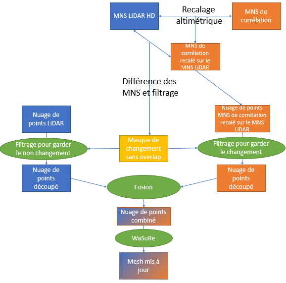

# Mise à jour de mesh LiDAR – Pipeline IGN (JNFT)

Pipeline complet de **mise à jour de mesh 3D** à partir de données LiDAR HD et de MNS de corrélation, avec détection de changement, fusion hybride et génération de produits mesh (PLY km, 3D Tiles).

Ce dépôt implémente une chaîne de traitement modulaire permettant de :

- récupérer les données nécessaires (LiDAR + MNS),
- réaligner altimétriquement les surfaces,
- détecter les zones modifiées,
- fusionner les nuages de points,
- générer un mesh via **WaSuRe**,
- produire des PLY colorisés (ortho / origine),
- découper en tuiles kilométriques,
- générer des **3D Tiles** pour visualisation web.

Le schéma de principe de cette mise à jour est le suivant : 
<p align="center">
  
</p>
---

## Contexte

Objectif : mettre à jour un mesh LiDAR existant en intégrant uniquement les zones réellement modifiées (bâtiments récents, évolutions), tout en conservant les zones stables issues du LiDAR HD.

Le pipeline repose sur :

- LiDAR HD (référence stable),
- MNS de corrélation (nouvelle surface),
- recalage altimétrique robuste,
- masque de changement,
- fusion hybride,
- reconstruction surfacique via **WaSuRe**,
- production de livrables mesh et web.

Système de coordonnées principal : **EPSG:2154 (Lambert-93)**.

---

# Architecture du pipeline

Le pipeline est orchestré par `main.py`.

## Étapes principales

### 1️⃣ Création de l’arborescence projet
Module : `creation_arborescence.py`

Crée automatiquement la structure standard :

```
project/
├── nuage_points_lidar/
├── MNS_lidar/
├── MNS_correlation/
├── MNS_recale/
├── masque/
├── nuage_combine/
├── out_WASURE/
├── tmp/
└── logs/
```


---

### 2️⃣ Récupération des données
Module : `recuperation_donnees.py`

- Télécharge / copie les dalles LiDAR
- Récupère les MNS LiDAR
- Récupère les MNS de corrélation
- Vérifie la cohérence et la disponibilité des données

---

### 3️⃣ Recalage altimétrique
Module : `recalage_altimetrique.py`

Corrige le biais vertical entre :

```
MNS_corrélation  –  MNS_LiDAR
```

Méthode :
- estimation robuste via MAD
- itérations successives
- suppression des outliers

Produit : MNS recalé (z corrigé).

---

### 4️⃣ Création du masque de changement
Module : `creation_masque.py`

Détecte les zones réellement modifiées :

- différence verticale au-delà d’un seuil
- filtrage morphologique
- suppression des petits objets
- buffer optionnel

Produit : masque raster binaire :
- 0 → zone stable (LiDAR conservé)
- 1 → zone modifiée (MNS utilisé)

---

### 4bis️ Résumé par tuile (logs)
Module : `infos.py`

Analyse automatiquement les logs :

- dz estimé
- pourcentage de changement
- année du MNS corrélation (si détectable)

Produit :

```
tile_summary.csv
tile_grid_pct_changed.csv
tile_grid_dz.csv
tile_grid_corr_year.csv
```

Utile pour contrôle qualité spatial.

---

### 5️⃣ Fusion des nuages
Module : `fusion_nuages.py`

Construit un nuage de points hybride :

- conserve LiDAR si masque = 0
- injecte MNS si masque = 1

Produit : nuage combiné prêt pour WaSuRe.

---

### 6️⃣ Reconstruction mesh – WaSuRe
Module : `run_wasure.py`

- Lance WaSuRe
- Crée un dossier horodaté
- Sauvegarde les logs séparément
- Enregistre un JSON de traçabilité

Produit : tuiles PLY WaSuRe.

---

### 7️⃣ Shift en coordonnées globales L93
Module : `post_wasure_shift.py`

WaSuRe travaille en coordonnées locales.
On applique l’offset pour revenir en Lambert-93.

Produit : PLY globaux EPSG:2154.

---

### 8️⃣ Colorisation ortho (WMS IGN)
Module : `post_wasure_colorize_ortho_wms.py`

- Interroge le WMS IGN
- Échantillonne les couleurs
- Assigne RGB aux sommets

Produit : mesh colorisé par orthophoto (RGB par sommet).

---

### 9️⃣ Colorisation par origine
Module : `post_wasure_colorize_origin_multitif.py`

Colorie selon la provenance :

- Bleu → LiDAR
- Orange → MNS

Permet visualisation des zones modifiées.

---

### 9bis️ Reconstruction tuiles kilométriques
Module : `post_wasure_make_km_tiles.py`

- Regroupe les chunks WaSuRe (~125 m)
- Reconstruit des tuiles 1 km en s’alignant sur la grille des dalles MNS LiDAR
- Sélection conservative des triangles (sans découpe géométrique) pour éviter les trous aux frontières

Produit :

```
ply_km_tiles_ortho_L93/
ply_km_tiles_origin_L93/
```

---

### 🔟 Déshift (retour coordonnées locales)
Nécessaire pour le pipeline 3D Tiles WaSuRe (qui attend des PLY en coordonnées locales).

---

### 1️⃣1️⃣ Génération 3D Tiles
Module : `run_mesh23dtile.py`

- Conversion PLY → 3D Tiles
- Exécution via Docker
- Support multi-process
- Sortie prête pour iTowns / Cesium

Produits :

```
3dtiles_ortho/
3dtiles_origin/
```

---

# Modules utilitaires supplémentaires

### `departement_wfs.py`

Interroge le WFS BD TOPO V3 pour déterminer quel(s) département(s) intersectent une tuile 1 km.

Permet :
- affectation départementale
- contrôle administratif
- statistiques par département

---

# Configuration

Les paramètres principaux sont définis dans `main.py` :

```python
RUN_WASURE = True
PROJECT_DIR = ...
LIDAR_URLS_TXT = ...
```

Chaque étape possède sa propre classe `Config`.

---

# Dépendances principales

- Python ≥ 3.10
- numpy
- pandas
- rasterio
- shapely
- requests
- meshio
- plyfile
- WaSuRe (Spark pipeline)
- Docker (pour mesh23dtile)

---

# Système de coordonnées

- Travail principal : **EPSG:2154 (Lambert-93)**
- WaSuRe : coordonnées locales + offset
- 3D Tiles : conversion interne vers EPSG:4978

---

# Produits finaux

- Mesh PLY L93
- Mesh PLY km
- Mesh colorisé ortho
- Mesh colorisé origine
- 3D Tiles (visualisation web)
- Résumé CSV par tuile

---


# Utilisation
Configurer les paramètres dans main.py
```bash
python main.py
```
## Paramètres à adapter (main.py)

Le script `main.py` enchaîne les étapes du pipeline avec des valeurs par défaut « raisonnables ».
Pour l’utiliser sur une nouvelle zone/projet, voici les paramètres à modifier en priorité.

### 1) Chemins et modes d’exécution

- `PROJECT_DIR`  
  Dossier racine du projet (l’arborescence standard y est créée).  
  Exemple : `/media/DATA/MESH_3D/out_mise_a_jour_mesh_JNFT/<zone>`

- `LIDAR_URLS_TXT`  
  Fichier texte listant les URLs (ou identifiants) des dalles LiDAR à récupérer/traiter pour la zone. A récupérer sur https://cartes.gouv.fr/telechargement/IGNF_NUAGES-DE-POINTS-LIDAR-HD

- `RUN_WASURE`  
  - `True` : relance WaSuRe et crée un nouveau `run_YYYY-mm-dd_HH-MM-SS` dans `out_wasure/`.  
  - `False` : réutilise le dernier run enregistré via `wasure_last_run.json` (utilisé surtout en cas de débug).

### 2) Paramètres de récupération des données (Step 2)

Dans `RetrievalConfig(...)` :

- `store_root`  
  Chemin vers le stockage des MNS de corrélation (racine du magasin/partage).  
  À adapter selon l'environnement (serveur, montage CIFS, etc.).

- `year_start` / `year_stop`  
  Plage d’années explorée pour choisir les MNS de corrélation disponibles.  
  Attention au sens : `year_start` correspond à l’année la plus récente (par ex. l’année courante), `year_stop` à la limite basse.

Dans `run_retrieval(...)` :

- `strict_missing_mns_correlation`  
  `True` : échec si une dalle MNS de corrélation manque.  
  `False` : continue en journalisant les manquants.

- `fetch_mns_lidar` / `strict_missing_mns_lidar`  
  Active la récupération des MNS LiDAR (référence) et décide si l’absence est bloquante.

### 3) Paramètres du recalage altimétrique (Step 3)

Dans `RecalageConfig(...)` :

- `k_mad`  
  Seuil robuste (MAD) pour filtrer les outliers lors de l’estimation du décalage vertical.

- `n_iter`  
  Nombre d’itérations de robustification (recalcul après filtrage).

- `overwrite`  
  Réécrit les résultats si présents.

### 4) Paramètres de création du masque de changement (Step 4)

Dans `MaskConfig(...)` :

- `z_tolerance_m`  
  Seuil vertical (m) au-delà duquel on considère qu’il y a changement entre DSM (corrélation) et MNS LiDAR.

- `window_radius`  
  Rayon (en pixels) utilisé pour des opérations locales (lissage/agrégation selon implémentation).

- `radius_open`, `min_area_m2`  
  Nettoyage morphologique et filtrage de petites zones (anti-bruit).

- `buffer_m`, `buffer_closing`  
  Tampon autour des zones de changement.

- `overwrite`  
  Réécrit les masques si présents.

### 5) Paramètres de fusion des nuages (Step 5)

Dans `FusionConfig(...)` :

- `chunk_size_lidar`  
  Taille des paquets de points LiDAR lus en streaming (impact RAM/perf).

- `block_size_dsm`  
  Taille des blocs raster DSM/mask pour générer les points DSM (impact perf/IO).

- `overwrite`  
  Réécrit les `.laz` combinés si présents.

### 6) Paramètres WaSuRe (Step 6)

Dans `WaSuReConfig(...)` :

- `wasure_repo_dir`  
  Chemin vers le dépôt `sparkling-wasure` (sur la machine où on exécute le pipeline).

- `wasure_script`  
  Script de lancement (`./run_lidarhd.sh`).

- `extra_args`  
  Pour ajouter des options WaSuRe si besoin (laisser `None` sinon).

- `fail_if_input_empty`  
  Sécurité : évite de lancer WaSuRe si le dossier d’entrée est vide.

### 7) Paramètres de shift/déshift PLY (Step 7 et Step 10)

Dans `PostWasureShiftConfig(...)` :

- `sign`
  - `+1` : applique le shift (coordonnées locales → Lambert-93) et produit `ply_L93/`.
  - `-1` : enlève le shift (Lambert-93 → local WaSuRe) pour alimenter `mesh23dtile`.

- `out_subdir`  
  Nom du sous-dossier de sortie dans `run_*/`.

- `ascii_out`  
  `False` recommandé (binaire plus compact).

- `overwrite`  
  Réécrit si présents.

### 8) Paramètres de colorisation ortho via WMS (Step 8)

Dans `OrthoWmsConfig(...)` :

- `gsd_m`  
  Résolution au sol demandée au WMS (0.20 m par défaut).

- `img_format`  
  `image/jpeg` (léger) ou `image/png` (sans pertes mais plus lourd).

- `sampling`  
  `nearest` (rapide) ou `bilinear` (plus doux).

- `bbox_buffer_m`  
  Tampon pour éviter les artefacts de bordure.

- `overwrite`  
  Réécrit si présents.

### 9) Paramètres de colorisation par origine (Step 9)

Dans `OriginColorConfig(...)` :

- `lidar_rgb`, `mns_rgb`, `default_rgb`  
  Couleurs des sommets selon l’origine (LiDAR / MNS / hors masque).

- `swap_meaning`  
  Inverse le sens 0/1 si besoin (selon convention du masque).

- `bbox_buffer_m`  
  Tampon pour limiter les effets de bord.

- `resolve_conflict`  
  Stratégie si plusieurs tuiles de masque couvrent un même sommet (`prefer_change` recommandé).

### 9bis) Paramètres de création des tuiles PLY 1 km (Step 9bis)

Dans `KmTilesConfig(...)` :

- `dsm_dir`  
  Dossier des tuiles MNS LiDAR (GeoTIFF) servant de grille 1 km.

- `out_dirname`  
  Nom du dossier de sortie (ex : `ply_km_tiles_ortho_L93`).

- `suffix`  
  Suffixe dans le nom des fichiers (ex : `ortho` ou `origin`).

- `preselect_buffer_m` / `eps_m`  
  Tampons géométriques pour sélectionner les chunks et conserver les triangles en bordure.

- `binary_out`  
  `True` recommandé (binaire).

### 11) Paramètres mesh23dtile / 3D Tiles (Step 11)

Dans `Mesh23DTileConfig(...)` :

- `exec_mode`  
  `docker` recommandé (environnement WaSuRe complet).

- `docker_image`  
  Image Docker contenant `mesh23Dtile` + `obj-tiler`.

- `docker_user`  
  `True` pour éviter des sorties possédées par root.

- `num_process`  
  Parallélisme (à ajuster selon CPU/RAM).

- `overwrite`  
  Réécrit le tileset si déjà présent.

---

### Checklist « je change de zone »

1. Mettre à jour `PROJECT_DIR` et `LIDAR_URLS_TXT`.
2. Vérifier `store_root` (accès au magasin MNS corrélation).
3. Ajuster `year_start/year_stop` selon les millésimes dispo.
4. Ajuster `num_process` (mesh23dtile) selon la machine.
---

# Reproductibilité

Chaque run WaSuRe est historisé :

```
out_WASURE/run_YYYY-MM-DD_HH-MM-SS/
```

et un fichier :

```
wasure_last_run.json
```

permet de rejouer les étapes aval sans relancer WaSuRe.

---

# Auteur

Edmond SAINT DENIS  
Projet IGN – Mise à jour mesh LiDAR

---

# Licence
MIT
